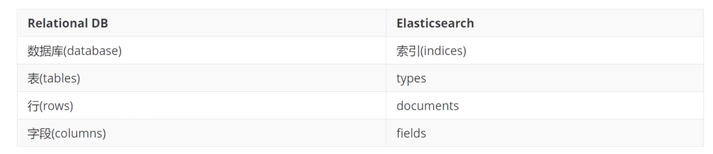
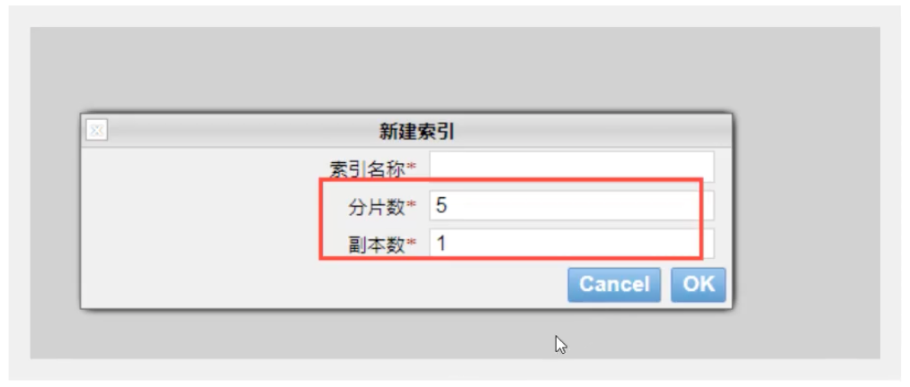
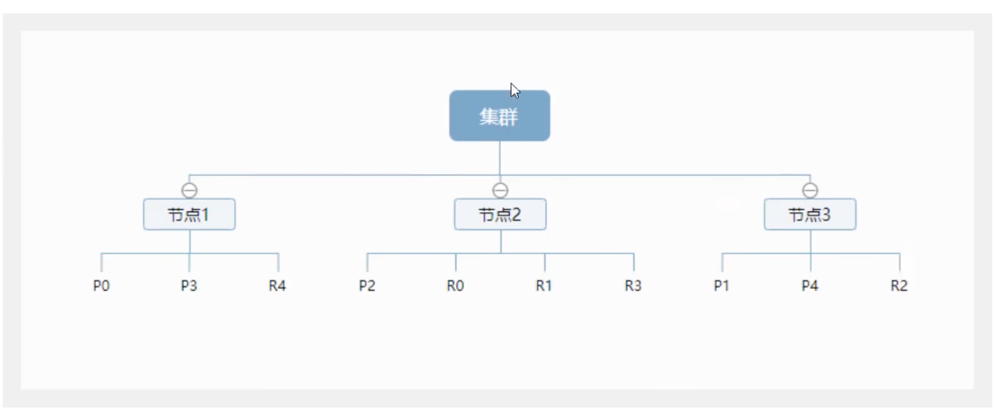
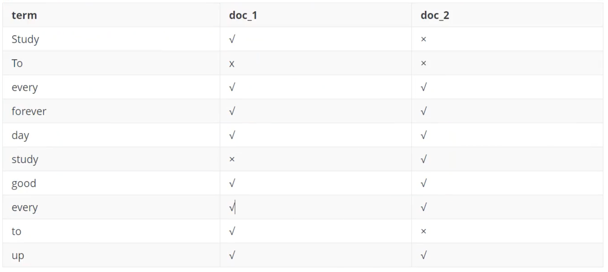
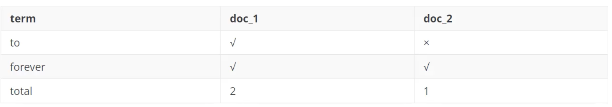
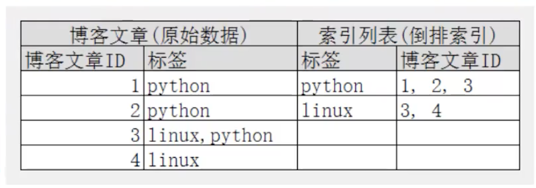
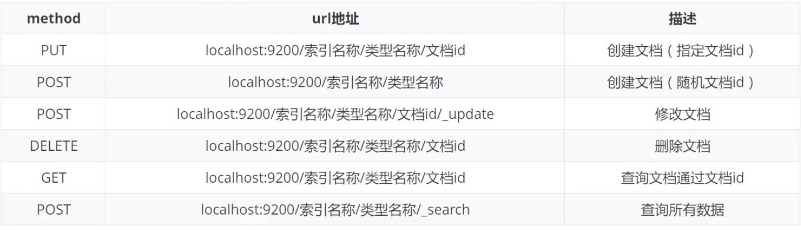

# ElasticSearch概述

ElasticSearch，简述es，es是一个开源的**高扩展**的**分布式全文检索引擎**，它可以**近乎实时的存储、检索数据**；本身扩展性很好，可以扩展到上百台服务器，处理PB级别（大数据时代）的数据。es也使用java开发并使用Lucene作为其核心来实现所有索引和搜索的功能，但是它的目的是通过简单的**RestFul API**来隐藏Lucene的复杂性，从而让全文搜索边的更加简单。

据国际权威的数据库产品评测机构DB Engines的统计，在2016年1月，ElasticSearch已超过Solr等，成为排名第一的搜索引擎应用。


# ElasticSearch安装

声明：JDK1.8，最低要求！ElasticSearch客户端，界面工具！

Java开发，ElastcSearch的版本与我们之后对应的Java的核心jar包！

初学时，就把es当作一个数据库！（可以建立索引（库），文档（库中的数据！））

```
ElasticSearch head插件当作数据展示工具！我们后面所有的查询，kibana
```


**了解ELK**

ELK是**ElasticSearch**、**Logstash**、**Kibana**三大开源框架首字母大写简称。市面上也被称为Elastic Stack。其中ElasticSearch是一个基于Lucene、分布式、通过RestFul方式进行交互的近实时搜索平台框架。类似百度、谷歌这种大数据搜索引擎的场景都可以使用ElasticSearch作为底层支持框架，可见ElasticSearch提供的搜索能力确实强大，市面上很多时候我们简称ElasticSearch为es。Logstash是ELK的中央数据流引擎，用于不同目标（文件/数据存储/MQ）收集的不同格式数据，经过过滤后支持输出到不同目的地（文件/MQ/Redis/ElasticSearch/kafka等）。Kibana可以将ElasticSearch的数据通过友好的页面展示出来，提供实时分析的功能。

收集清洗数据 --> 搜索，存储 --> Kibana

市面上很多开发之遥提到ELK能够一致说明它是一个日志分析架构技术栈总称，但实际上ELK不仅仅适用于日志分析，它还可以支持任何数据分析和收集的场景，日志分析和收集只是更加具有代表性。并非唯一性。


**安装Kibana**

Kibana是一个针对ElasticSearch的开源分析及可视化平台，用来搜索、查看交互存储在ElasticSearch索引中的数据。使用Kibana，可以通过各种图表进行高级数据分析及展示。Kibana让海量数据更容易理解。它操作简单，基于浏览器的用户界面可以快速创建仪表板（dashboard）实时显示ElasticSearch查询动态。设置Kibana非常简单。无需编码或者额外的基础架构，几分钟内就可以完成Kibana安装并启动ElasticSearch索引监测。


Kibana版本要跟ElasticSearch版本一致


好处：ELK基本上都是拆箱即用！


# ElasticSearch核心概念

## 概述

在前面的学习中，我们已经掌握里es是什么，同时也把es的服务已经安装启动，那么es是如何去存储数据，数据结构是什么，又是如何实现搜索的呢？我们先来聊聊ElasticSearch的相关概念吧！


## 常见定义

```
ElasticSearch是面向文档	关系型数据库和ElasticSearch客观的对比！一切都是json
```



ElasticSearch（集群）中可以包括多个索引（数据库），每个索引中可以包含多个类型（表），每个类型下又包含多个文档（行），每个文档中又包含多个字段（列）。


## 物理设计

ElasticSearch在后台把每个索引切分成多个分片，每份分片可以在集群中的不同服务器间迁移

一个人就是一个集群！


## 逻辑设计

```
文档
```

一个索引类型中，包含多个文档，比如说文档1，文档2。当我们索引一篇文档时，可以通过这样的一个顺序找到它：索引->类型->文档ID，通过这个组合我们就能索引到某个具体的文档。注意：ID不必是整数，实际上它是个字符串。

之前说ElasticSearch是面向文档的，那么就以为这索引和搜索数据的做小单位就是文档，ElasticSearch中，文档有几个重要属性：

- 自我包含，一篇文档同时包含字段和对应的值，也就是同时包含key:value！
- 可以是层次型的，一个文档中包含自文档，复杂的逻辑实体就是这么来的！
- 灵活的结构，文档不依赖于预先定义的模式，我们知道关系型数据库中，要提前定义字段才能使用，在EalsticSearch中，对于字段是非常灵活的，有时候，我们可以忽略该字段，或者动态的添加一个新的字段。

尽管我们可以随意的新增或者忽略某个字段，但是，每个字段的类型非常重要，比如一个年龄字段类型，可以是字符串也可以是整形。因为ElasticSearch会保存字段和类型之间的映射及其他的设置。这种映射到每个映射的每种类型，这也是为什么在ElasticSearch中，类型有时候也称为映射类型。

```
类型
```

类型是文档的逻辑容器，就像关系型数据库一样，表格是行的容器。类型中对于字段的定义称为映射，比如name映射为字符串类型。我们说文档时无模式的，它们不需要拥有映射中所定义的所有字段，比如新增一个字段，那么ElasticSearch时怎么做的呢？EalsticSearch会自动的将新字段加入映射，但是这个字段不确定它是什么类型，ElasticSearch就开始猜，如果这个值 是18，那么ElasticSearch会认为它是整形。但是ElasticSearch也可能猜不对，所以最安全的方式就是提前定义好所需要的映射，这点跟关系型数据库殊途同归，先定义好字段，然后再使用。

```
索引
```

就是数据库

索引是映射类型的容器，ElasticSearch中的索引是一个非常大的文档集合。索引存储了映射类型的其他字段和其他设置。然后它们被存储到了各个分片上了。我们来研究下分片是如何工作的。

**物理设计：节点和分片如何工作**

一个集群至少有一个节点，而一个节点就是一个ElasticSearch进程，即诶带你可以有多个索引默认的，如果你创建索引，那么索引将会有5个分片（primary shard，又称主分片）构成的，每个主分片会有一个副本（replica shard，又称辅助分片）





上图是一个有3个节点的集群，可以看到主分片和对应的复制分片都不会在同一个节点内，这样有利于某个节点挂掉，数据也不至于丢失。实际上，一个分片是一个Lucene索引，一个包含**倒排索引**的文件目录，倒排索引的结构是的ElasticSearch在不扫描全部文档的情况下，就能告诉你哪些文档包含特定的关键字。

```
倒排索引
```

ElasticSearch使用的是一种称为倒排索引的结构，采用Lucene倒排索引作为底层。这种结构适用于快速的全文搜索，一个索引由文档中所有不重复的列表构成，对于每一个词，都有一个包含它的文档列表。例如现在有两个文档，每个文档包含如下内容：

```yaml
Study every day,good good up to forever # 文档1包含的内容
To forever,study every day,good good # 文档2包含的内容
```

为了创建倒排索引，我们首先要将每个文档拆分成独立的词（或称词条或称tokens），然后创建一个包含所有不重复的词条的排序列表，然后列出每个词条出现在哪个文档：



现在，我们试图搜索to forever，只需要查看包含每个词条的文档，最终形成权重（score）



两个文档都匹配，但是第一个文档比第二个匹配程度高。如果没有别的条件，现在，这包含两个关键字的文档都将返回。

再来看一个示例，比如我们通过博客标签来搜索博客文章。那么倒排索引列表就是这样一个结构：



如果要搜索含有python标签的文章，那相对于查找所有原始数据而言，查找倒排索引将会快的多。只需要查看标签这一栏，然后获取相关文章ID即可。完全过滤掉无关的所有数据，提高效率！

ElasticSearch的索引和Lucene的索引对比

在ElasticSearch中，索引这个词频繁使用，这就是术语的使用。在ElasticSearch中，索引被分为多个分片，每份分片是一个Lucene的索引。所以一个ElasticSearch索引是由多个Lucene索引组成的。

# IK分词器插件

```
什么是IK分词器？
```

分词：即把一段中文或者别的划分成一个个的关键字，我们在搜索的时候会把自己的信息进行分词，会把数据库中的数据进行分词，然后进行一个匹配操作，默认的中文分词是将每个字看成一个词，比如“我爱学习”会被分成“我”，“爱”，“学“，”习“，这显然是不符合要求的，所以我们需要安装中文分词器IK来解决这个问题。

如果要使用中文，建议使用IK分词器！

IK提供来两个分词算法，ik_smart和ik_max_word，其中ik_smart为最少切片，ik_max_word为最细粒度划分！

自己需要的词，需要自己加到字典中，ik分词器添加自己的配置

# Rest风格说明

一种软件架构风格，而不是标准，只是提供了一组设计原则和约束条件。它主要用于客户端和服务器交互类的软件。基于这种风格设计的软件可以更简洁，更有层次，更易于实现缓存等机制。

基本Rest命令说明：




