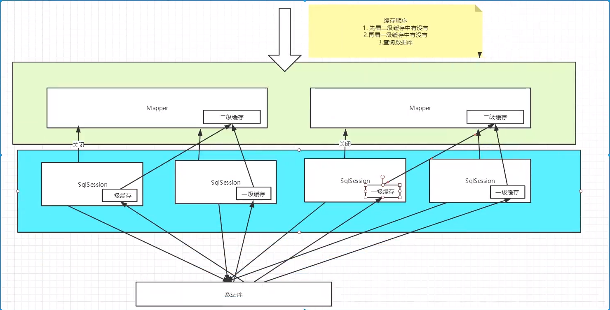

## 1、简介

### 1.1、什么是Mybatis

- Mybatis是一款优秀的**持久化框架**。
- 它支持定制化SQL、存储过程以及高级映射。
- Mybatis避免了几乎所有的JDBC代码和手动设置参数以及获取结果集。
- Mybatis可以使用简单的XML或注解来配置和映射原生类型、接口和Java的POJO（Plain Old Java Object，普通老式Java对象）为数据库中的记录。


如何获得Mybatis？

- maven仓库
- Github
- 中文文档：https://mybatis.org/mybatis-3/zh/index.html

### 1.2、持久化

- 数据持久化：将程序的数据在持久状态和瞬时状态转化的过程。
- 内存：断电即失

- 数据库（JDBC），IO文件持久化

### 1.3、持久层

Dao层、Service层、Controller层。。。

- 完成持久化工作的代码块
- 层界限十分明显

### 1.4、为什么需要Mybatis？

- 传统的JDBC过于复杂
- 帮助程序员将数据存入数据库中
- 更容易上手

优点

- 简单易学
- 灵活
- sql和代码的分离，提高了可维护性
- 提供映射标签，支持对象与数据的orm字段关系映射
- 提供对象关系映射标签，支持对象关系组建维护
- 提供xml标签，支持编写动态sql

## 2、第一个Mybatis程序

### 2.1、新建项目

1. 新建一个普通的maven项目

2. 删除src目录

3. 导入maven依赖

   ```xml
   <!-- https://mvnrepository.com/artifact/mysql/mysql-connector-java -->
   <dependency>
       <groupId>mysql</groupId>
       <artifactId>mysql-connector-java</artifactId>
       <version>5.1.47</version>
   </dependency>
   <!-- https://mvnrepository.com/artifact/org.mybatis/mybatis -->
   <dependency>
       <groupId>org.mybatis</groupId>
       <artifactId>mybatis</artifactId>
       <version>3.5.2</version>
   </dependency>
   <!-- https://mvnrepository.com/artifact/junit/junit -->
   <dependency>
       <groupId>junit</groupId>
       <artifactId>junit</artifactId>
       <version>4.12</version>
   </dependency>
   
   ```

### 2.2、创建一个模块

- 编写mybatis的核心配置文件

  ```xml
  <?xml version="1.0" encoding="UTF-8" ?>
  <!DOCTYPE configuration
    PUBLIC "-//mybatis.org//DTD Config 3.0//EN"
    "http://mybatis.org/dtd/mybatis-3-config.dtd">
  <configuration>
    <environments default="development">
      <environment id="development">
        <transactionManager type="JDBC"/>
        <dataSource type="POOLED">
          <property name="driver" value="${driver}"/>
          <property name="url" value="${url}"/>
          <property name="username" value="${username}"/>
          <property name="password" value="${password}"/>
        </dataSource>
      </environment>
    </environments>
    <mappers>
      <mapper resource="org/mybatis/example/BlogMapper.xml"/>
    </mappers>
  </configuration>
  ```

- 编写mybatis工具类

  ```java
  package com.kuang.utils;
  
  import org.apache.ibatis.io.Resources;
  import org.apache.ibatis.session.SqlSession;
  import org.apache.ibatis.session.SqlSessionFactory;
  import org.apache.ibatis.session.SqlSessionFactoryBuilder;
  
  import java.io.IOException;
  import java.io.InputStream;
  
  /**
   * Description:
   *
   * @author wenjie
   * @date Create on 2020/11/21
   */
  // sqlSessionFactory -> sqlSession
  public class MybatisUtil {
      private static SqlSessionFactory sqlSessionFactory;
      static {
          try {
              // 第一步：获取sqlSessionFactory对象
              String resource = "mybatis-config.xml";
              InputStream inputStream = Resources.getResourceAsStream(resource);
              sqlSessionFactory = new SqlSessionFactoryBuilder().build(inputStream);
          } catch (IOException e) {
              e.printStackTrace();
          }
      }
  
      // 既然有了 SqlSessionFactory，顾名思义，我们可以从中获得 SqlSession 的实例。
      // SqlSession 提供了在数据库执行 SQL 命令所需的所有方法。你可以通过 SqlSession 实例来直接执行已映射的 SQL 语句。
      public static SqlSession getSqlSession() {
          SqlSession sqlSession = sqlSessionFactory.openSession();
          return sqlSession;
      }
  }
  
  ```


### 2.3、编写代码

**常见错误：**

​	maven由于他的约束大于配置，我们之后可能遇到我们写的配置文件，无法被导出或者生效的问题，解决方案：

```xml
<!--在build中配置resources，来防止我们资源导出失败的问题-->
<build>
        <resources>
            <resource>
                <directory>src/main/resources</directory>
                <includes>
                    <include>**/*.properties</include>
                    <include>**/*.xml</include>
                </includes>
                <filtering>true</filtering>
            </resource>
            <resource>
                <directory>src/main/java</directory>
                <includes>
                    <include>**/*.properties</include>
                    <include>**/*.xml</include>
                </includes>
                <filtering>true</filtering>
            </resource>
        </resources>
    </build>
```


- 实体类

- Dao接口

- 测试

  ```java
  public class MyTest {
  
      @Test
      public void test() {
          // 第一步：获得sqlSession对象
          SqlSession sqlSession = MybatisUtil.getSqlSession();
          // 执行sql
          UserMapper userMapper = sqlSession.getMapper(UserMapper.class);
          List<User> list = userMapper.getUserList();
          for (User user : list) {
              System.out.println(user.toString());
          }
  
          // 关闭sqlSession
          sqlSession.close();
      }
  }
  ```


## 3、CRUD

### 万能的Map

假设，我们的实体类，或者数据库中的表，字段或者参数过多，我们应该考虑使用Map

```java
// 万能的Map
int addUser(Map<String,Object> map);
```

```xml
<!--对象中的属性，可以直接取出来	传递map的key-->
<insert id="addUser" parameterType="map">
    insert into user (id,pwd) values (#{userid},#{password});
</insert>
```

```java
@Test
public void addUser() {
    SqlSession sqlSession = MybatisUtils.getSqlSession();
    
    UserMapper mapper = sqlSession.getMapper(UserMapper.class);
    
    Map<String,Object> map = new HashMap<String,Object>();
    map.put("userid",5);
    map.put("password","233");
    mapper.addUser(map);
    
    mapper.commit;
    
    sqlSession.close();
}
```

map传递参数，直接在sql取出key即可！【parameterType=“map”】

对象传递参数，直接在sql取对象的属性即可！【parameterType=“Object”】

只有一个基本类型参数的情况下，可以直接在sql中取到。

## 4、配置解析

### 环境配置

Mybatis可以配置成适应多种环境

不过要记住尽管可以配置多个环境，但每个SqlSessionFactory实例只能选择一种环境。

学会配置多套运行环境

Mybatis默认的事务管理器就是JDBC，连接池：POOLED

## 5、日志

### 5.1、日志工厂

如果一个数据库操作，出现了异常，我们需要拍错。日志就是最好的助手！

曾经：sout，debug

```xml
<!--配置于mybatis-config.xml中-->
<settings>
    <setting name="logImpl" value="STDOUT_LOGGING"/>
</settings>
```

### 5.2、Log4j

什么是Log4j？

- Log4j是[Apache](https://baike.baidu.com/item/Apache/8512995)的一个开源项目，通过使用Log4j，我们可以控制日志信息输送的目的地是[控制台](https://baike.baidu.com/item/控制台/2438626)、文件、[GUI](https://baike.baidu.com/item/GUI)组件
- 我们也可以控制每一条日志的输出格式
- 通过定义每一条日志信息的级别，我们能够更加细致地控制日志的生成过程。
- 最令人感兴趣的就是，这些可以通过一个[配置文件](https://baike.baidu.com/item/配置文件/286550)来灵活地进行配置，而不需要修改应用的代码。


1.先导入log4j的包

```xml
<!-- https://mvnrepository.com/artifact/log4j/log4j -->
<dependency>
    <groupId>log4j</groupId>
    <artifactId>log4j</artifactId>
    <version>1.2.17</version>
</dependency>
```

2.log4j.properties

```properties
#将等级为DEBUG的日志信息输出到console和file这两个目的地，console和file的定义在下面的代码
log4j.rootLogger=DEBUG,console,file

#控制台输出的相关设置
log4j.appender.console = org.apache.log4j.ConsoleAppender
log4j.appender.console.Target = System.out
log4j.appender.console.Threshold=DEBUG
log4j.appender.console.layout = org.apache.log4j.PatternLayout
log4j.appender.console.layout.ConversionPattern=[%c]-%m%n

#文件输出的相关设置
log4j.appender.file = org.apache.log4j.RollingFileAppender
log4j.appender.file.File=./log/kuang.log
log4j.appender.file.MaxFileSize=10mb
log4j.appender.file.Threshold=DEBUG
log4j.appender.file.layout=org.apache.log4j.PatternLayout
log4j.appender.file.layout.ConversionPattern=[%p][%d{yy-MM-dd}][%c]%m%n

#日志输出级别
log4j.logger.org.mybatis=DEBUG
log4j.logger.java.sql=DEBUG
log4j.logger.java.sql.Statement=DEBUG
log4j.logger.java.sql.ResultSet=DEBUG
log4j.logger.java.sql.PreparedStatement=DEBUG
```

3.配置

```xml
<settings>
    <setting name="logImpl" value="LOG4J"/>
</settings>
```


简单使用：

1. 在要使用Log4j的类中，导入包import org.apache.log4j.Logger;

2. 日志对象，参数为当前类的class

   ```java
   static Logger logger = Logger.getLogger(MyTest.class);
   ```

3. 日志级别

   ```java
   logger.info("info:进入了testLog4j");
   logger.debug("debug:进入了testLog4j");
   logger.error("error:进入了testLog4j");
   ```

## 6、分页

### 使用limit分页

```sql
select * from user limit startIndex,pageSize;
```

使用Mybatis实现分页，核心SQL

1. 接口

   ```java
   List<User> getUserByLimit(Map<String,Integer> map);
   ```

2. Mapper.xml

   ```xml
   <select id="getUserByLimit" parameterType="map" resultMap="userMap">
   	select * from user limit #{startIndex,pagesize}
   </select>
   ```

3. 测试

   ```java
   @Test
   public void getUserByLimitTest() {
       SqlSession sqlSession = MybatisUtil.getSqlSession();
       UserMapper mapper = sqlSession.getMapper(UserMapper.class);
       
       HashMapper<String,Integer> map = new HashMap<String,Integer>();
       map.put("startIdex",1);
       map.put("pageSize",2);
       
       List<User> userList = mapper.getUserBuLimit(map);
       for (User user : userList) {
           System.out.println(user);
       }
       sqlSession.close();
   }
   ```

## 7、使用注解开发

### 7.1、面向接口编程

- 大家之前都学过面向对象编程，也学过接口，但是在真正的开发中，很多时候我们会选择面向接口编程。
- **根本原因：解耦，可拓展，提高复用，分层开发中，上层不用管具体的实现，大家都遵守相同的标准，使得开发变得容易，规范性更好。**
- 在一个面向对象的系统中，系统的各种功能是由许许多多的不同对象协作完成的。在这种情况下，各个对象内部是如何实现自己的，对系统设计人员来讲就不那么重要了。
- 而各个对象之间的协作关系则成为系统设计的关键。小到不同类之间的通信，大到各模块之间的交互，在系统设计之初都是要着重考虑的，这也是系统设计的主要内容。面向接口编程就是按照这种思想来编程。


**关于接口的理解**

- 接口从更深层级的理解，应是定义（规范，约束）与实现（名实分离的原则）的分离
- 接口的本身反映了系统设计人员对系统的抽象理解
- 接口应有两类：
  - 第一类是对一个个体的抽象，它可对应为一个抽象体（abstract class）；
  - 第二类是一个个体某一方面的抽象，即形成一个抽象面（interface）；
- 一个个体有可能有多个抽象面。抽象体与抽象面有区别的


**三个面向区别**

- 面向对象是指，我们考虑问题时，以对象为单位，考虑它的属性及方法。
- 面向过程是指，我们考虑问题时，以一个具体的流程（事务过程）为单位，考虑它的实现。
- 接口设计与非接口设计是针对复用技术而言的，与面向对象（过程）不是一个问题，更多的体现就是对系统整体的架构

### 7.2、使用注解开发

1. 注解在接口上实现

   ```java
   package org.mybatis.example;
   public interface BlogMapper {
     @Select("SELECT * FROM blog WHERE id = #{id}")
     Blog selectBlog(int id);
   }
   ```

   使用注解来映射简单语句会使代码显得更加简洁，但对于稍微复杂一点的语句，Java 注解不仅力不从心，还会让你本就复杂的 SQL 语句更加混乱不堪。 因此，如果你需要做一些很复杂的操作，最好用 XML 来映射语句。

2. 需要在核心配置文件中绑定接口！

   ```xml
   <mappers>
   	<mappper class="com.kuang.dao.UserMapper"/>
   </mappers>
   ```

3. 测试


本质：反射机制实现

底层：动态代理

## 8、缓存

### 8.1、简介

```
查询	：	连接数据库	，耗资源！
	一次查询的结果，给他暂存在一个可以直接取到的地方！-->内存	：	缓存
	
我们再次查询相同数据的时候，直接走缓存，就不用走数据库了
```


1. 什么是缓存【cache】？
   - 存在内存中的临时数据
   - 将用户经常查询的数据放在缓存（内存）中，用户去查询数据就不用从磁盘上（关系型数据库数据文件）查询，从缓存中查询，从而提高查询效率，解决了高并发系统的性能问题。
2. 为什么使用缓存？
   - 减少和数据库的交互次数，减少系统开销，提高系统效率。
3. 什么样的数据能使用缓存？
   - 经常查询并且不经常改变的数据。


### 8.2、Mybatis缓存

- Mybatis包含一个非常强大的查询缓存特性，它可以非常方便地定制和配置缓存。缓存可以极大的提升查询效率。
- Mybatis系统中默认定义了两级缓存：**一级缓存**和**二级缓存**
  - 默认情况下，只有一级缓存开启。（sqlSession级别的缓存，也成为本地缓存）
  - 二级缓存需要手动开启和配置，他是基于namespace级别的缓存。
  - 为了提高扩展性，Mybatis定义了缓存接口Cache。我们可以通过实现Cache接口来自定义二级缓存。


### 8.3、一级缓存

- 一级缓存也叫本地缓存：SqlSession
  - 与数据库同一次会话期间查询到的数据会放在本地缓存中。
  - 以后如果需要获得相同的数据，直接从缓存中拿，没必要再去查询数据库。


缓存失效的情况：

1. 查询不同的东西
2. 增删改操作，可能会改变原来的数据，所以必定会刷新缓存！
3. 查询不同的Mapper.xml
4. 手动清理缓存！


小结：一级缓存默认是开启的，只在一次SqlSession有效，也就是拿到连接到关闭连接的这个区间段！


### 8.4、二级缓存

- 二级缓存也叫全局缓存，一级缓存作用域太低了，所以诞生了二级缓存
- 基于namespace级别的缓存，一个名称空间，对应一个二级缓存
- 工作机制
  - 一个会话查询一条数据，这个数据就会被放在当前会话的一级缓存中
  - 如果当前会话关闭了，这个会话对应的一级缓存就没了；但说我们呢想要的是，会话关闭了，一级缓存中的数据被保存到二级缓存中
  - 新的会话查询信息，就可以从二级缓存中获取内容
  - 不同的mapper查出的数据就会放在自己对应的缓存（map）中


步骤：

1. 开启全局缓存

   ```xml
   <!--显式的开启全局缓存-->
   <setting name="cacheEnabled" value="true"/>
   ```

2. 在要使用二级缓存的Mapper中开启

   ```xml
   <!--在当前Mapper.xml中使用二级缓存-->
   <cache/>
   ```

   也可以自定义参数

   ```xml
   <!--在当前Mapper.xml中使用二级缓存-->
   <cache eviction="FIFO"
          flushInterval="60000"
          size="512"
          readOnly="true"/>
   ```

3. 测试

   问题：我们需要将实体类序列化！


小结：

- 只要开启了二级缓存，在同一个Mapper下就有效
- 所有的数据都会放在一级缓存中
- 只有当会话提交，或者关闭的时候，才会提交到二级缓存中


### 8.5、缓存原理

