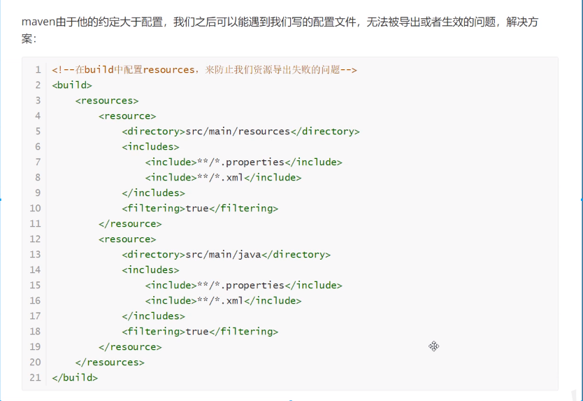

# Mybatis

## 1、简介

### 1.1、什么是Mybatis

- Mybatis是一款优秀的**持久化框架**。
- 它支持定制化SQL、存储过程以及高级映射。
- Mybatis避免了几乎所有的JDBC代码和手动设置参数以及获取结果集。
- Mybatis可以使用简单的XML或注解来配置和映射原生类型、接口和Java的POJO（Plain Old Java Object，普通老式Java对象）为数据库中的记录。


如何获得Mybatis？

- maven仓库
- Github
- 中文文档：https://mybatis.org/mybatis-3/zh/index.html

### 1.2、持久化

- 数据持久化：将程序的数据在持久状态和瞬时状态转化的过程。
- 内存：断电即失

- 数据库（JDBC），IO文件持久化

### 1.3、持久层

Dao层、Service层、Controller层。。。

- 完成持久化工作的代码块
- 层界限十分明显

### 1.4、为什么需要Mybatis？

- 传统的JDBC过于复杂
- 帮助程序员将数据存入数据库中
- 更容易上手

优点

- 简单易学
- 灵活
- sql和代码的分离，提高了可维护性
- 提供映射标签，支持对象与数据的orm字段关系映射
- 提供对象关系映射标签，支持对象关系组建维护
- 提供xml标签，支持编写动态sql

## 2、第一个Mybatis程序

新建项目

1. 新建一个普通的maven项目

2. 删除src目录

3. 导入maven依赖

   ```xml
   <!-- https://mvnrepository.com/artifact/mysql/mysql-connector-java -->
   <dependency>
       <groupId>mysql</groupId>
       <artifactId>mysql-connector-java</artifactId>
       <version>5.1.47</version>
   </dependency>
   <!-- https://mvnrepository.com/artifact/org.mybatis/mybatis -->
   <dependency>
       <groupId>org.mybatis</groupId>
       <artifactId>mybatis</artifactId>
       <version>3.5.2</version>
   </dependency>
   <!-- https://mvnrepository.com/artifact/junit/junit -->
   <dependency>
       <groupId>junit</groupId>
       <artifactId>junit</artifactId>
       <version>4.12</version>
   </dependency>
   
   ```

### 2.2、创建一个模块

- 编写mybatis的核心配置文件

  ```xml
  <?xml version="1.0" encoding="UTF-8" ?>
  <!DOCTYPE configuration
    PUBLIC "-//mybatis.org//DTD Config 3.0//EN"
    "http://mybatis.org/dtd/mybatis-3-config.dtd">
  <configuration>
    <environments default="development">
      <environment id="development">
        <transactionManager type="JDBC"/>
        <dataSource type="POOLED">
          <property name="driver" value="${driver}"/>
          <property name="url" value="${url}"/>
          <property name="username" value="${username}"/>
          <property name="password" value="${password}"/>
        </dataSource>
      </environment>
    </environments>
    <mappers>
      <mapper resource="org/mybatis/example/BlogMapper.xml"/>
    </mappers>
  </configuration>
  ```

- 编写mybatis工具类

  ```java
  package com.kuang.utils;
  
  import org.apache.ibatis.io.Resources;
  import org.apache.ibatis.session.SqlSession;
  import org.apache.ibatis.session.SqlSessionFactory;
  import org.apache.ibatis.session.SqlSessionFactoryBuilder;
  
  import java.io.IOException;
  import java.io.InputStream;
  
  /**
   * Description:
   *
   * @author wenjie
   * @date Create on 2020/11/21
   */
  // sqlSessionFactory -> sqlSession
  public class MybatisUtil {
      private static SqlSessionFactory sqlSessionFactory;
      static {
          try {
              // 第一步：获取sqlSessionFactory对象
              String resource = "mybatis-config.xml";
              InputStream inputStream = Resources.getResourceAsStream(resource);
              sqlSessionFactory = new SqlSessionFactoryBuilder().build(inputStream);
          } catch (IOException e) {
              e.printStackTrace();
          }
      }
  
      // 既然有了 SqlSessionFactory，顾名思义，我们可以从中获得 SqlSession 的实例。
      // SqlSession 提供了在数据库执行 SQL 命令所需的所有方法。你可以通过 SqlSession 实例来直接执行已映射的 SQL 语句。
      public static SqlSession getSqlSession() {
          SqlSession sqlSession = sqlSessionFactory.openSession();
          return sqlSession;
      }
  }
  
  ```

  

### 2.3、编写代码

**常见错误：**



- 实体类
- Dao接口

