# Spring

## 1、Spring

### 1.1、简介

- SSH：Struct2 + Spring + Hibernate
- SSM：SpringMVC + Spring + Mybatis

```xml
<!-- https://mvnrepository.com/artifact/org.springframework/spring-webmvc -->
<dependency>
    <groupId>org.springframework</groupId>
    <artifactId>spring-webmvc</artifactId>
    <version>5.2.0.RELEASE</version>
</dependency>
<!-- https://mvnrepository.com/artifact/org.springframework/spring-jdbc -->
<dependency>
    <groupId>org.springframework</groupId>
    <artifactId>spring-jdbc</artifactId>
    <version>5.2.0.RELEASE</version>
</dependency>

```

### 1.2、优点

- Spring是一个开源的免费框架
- Spring是一个轻量级的、非入侵式的框架
- 控制反转（IOC），面向切面编程（AOP）
- 支持事物的处理，对框架整合的支持


**总结一句话：Spring就是一个轻量级的控制反转（IOC）和面向切面编程的框架！**

### 1.3、组成


### 1.4、扩展

- Spring Boot

  - 一个快速开发的脚手架

  - 基于SpringBooy可快速开发单个微服务

- Spring Cloud

  - SpringCloud是基于SpringBoot实现的

  

学习SpringBoot的前提，需要完全掌握Spring及SpringMVC！承上启下的作用。

## 2、IOC理论

### 2.1、背景

 在没用使用Spring的时候——也就是没有依赖注入的时候，java应用程序的类与类之间要实现相互的功能协作是比较费劲的，某个类（A）要实现它的功能如果需要依赖另一个类（B）的协作的话，就需要在A类中主动创建出B类的对象，才能使用B类的方法完成功能（这里看官就不要去纠结静态方法之类的情况了）。**这等于是A类需要负责B类对象整个生命周期的管理。**在极度简单的情况下，在一个类中new出另一个类的对象似乎并没有什么问题，但是复杂的应用程序类与类的协作关系往往是多边的，我们并不知道一个类功能的实现会依赖多少个另类对象来协作，**所以在类中自行创建对象并且管理对象的整个生命周期，会造成代码的高度耦合以及不可想象的复杂度。**


1.UserDao 接口

2.UserDaoImpl实现类

3.UserService业务接口

4.UserServiceImpl业务实现类


在我们之前的业务中，用户的需求可能会影响到我们原来的代码，我们需要去根据用户的需求去修改源代码！如果程序源代码量非常大，修改一次的成本价格昂贵！


我们使用一个Set接口实现，已经发生了革命性的变化！

```java
    // 利用set进行动态实现值的注入！
    public void setUserDao(UserDao userDao) {
        this.userDao = userDao;
    }
```

- **之前，程序是主动创建对象！控制权在程序员手上！**
- **使用了set注入之后，程序不再具有主动性，而是变成了被动的接受对象！**


**这种思想，从本质上解决了问题，我们程序员不用再去管理对象的创建了。系统的耦合性大大降低~，可以更加专注在业务的实现上。这是IOC的原型。**

### 2.2、IOC本质

**控制反转IoC（Inversion of Control）是一种设计思想，DI（依赖注入）是实现IoC的一种方法**，也有人认为DI只是IoC的另一种说法。没有IoC的程序中，我们使用面向对象编程，对象的创建与对象间的依赖关系完全硬编码在程序中，对象的创建由程序自己控制，控制反转后将对象的创建转移给第三方，个人认为所谓控制反转就是：获得依赖对象的方式反转了。


采用XML方式配置Bean的时候，Bean的定义信息是和实现的分离的，而采用注解的方式可以把两者合为一体，Bean的定义信息直接以注解的形式定义在实现类中，从而达到零配置的目的。


**控制反转是一种通过描述（XML或注解）并通过第三方去生产或获取特定对象的方式。在Spring中实现控制反转的是Ioc容器，其实现方法是依赖注入（Dependency Injection，DI）。**


## 3、IOC创建对象的方式

1.使用无参构造创建对象，默认！

2.结社我们要使用有参构造构建对象：

​	1.下标赋值

```xml
<bean id="exampleBean" class="examples.ExampleBean">
    <constructor-arg index="0" value="7500000"/>
    <constructor-arg index="1" value="42"/>
</bean>
```

​	2.类型

```xml
<bean id="exampleBean" class="examples.ExampleBean">
    <constructor-arg type="int" value="7500000"/>
    <constructor-arg type="java.lang.String" value="42"/>
</bean>
```

​	3.参数名

```xml
<bean id="exampleBean" class="examples.ExampleBean">
    <constructor-arg name="years" value="7500000"/>
    <constructor-arg name="ultimateAnswer" value="42"/>
</bean>
```


**总结：在配置文件加载的时候，容器中管理的对象就已经初始化了。**

## 4、Spring配置

### 4.1、别名

```xml
<!--别名，如果添加了别名，我们也可以使用别名获取到这个对象-->
<alias name="user" alias="userNew"/>
```

### 4.2、Bean的配置

```xml
<!--
id : bean的唯一标识符，也就是我们学的对象名
class ： bean对象所对应的全限包名，
name ：也是别名，可以取多个
-->
<bean id="User" class="com.kuang.pojo.User" name="u2,u3,u4"/>
```

### 4.3、Bean的配置

一般用于团队开发使用，它可以将多个配置文件，导入合并为一个。

假设，现在项目中有多个人开发，这三个人负责不同的类开发，不同的类需要注册在不同的bean中，我们可以利用import将所有人的beans.xml合并为一个总的！

- 张三
- 李四
- 王五

- applicationContext.xml

  ```xml
  <import resource="bean.xml"/>
  <import resource="bean2.xml"/>
  <import resource="bean3.xml"/>
  ```

  使用的时候用这个applicationContext.xml总的配置就可以了

## 5、依赖注入

### 5.1、构造器注入

前面已经说过了

### 5.2、Set方式注入(重点)

- 依赖注入：Set注入！
  - 依赖：bean对象的创建依赖于容器
  - 注入：bean对象中的所有属性，由容器来注入！

```xml
<bean id="moreComplexObject" class="example.ComplexObject">
    <!-- results in a setAdminEmails(java.util.Properties) call -->
    <property name="adminEmails">
        <props>
            <prop key="administrator">administrator@example.org</prop>
            <prop key="support">support@example.org</prop>
            <prop key="development">development@example.org</prop>
        </props>
    </property>
    <!-- results in a setSomeList(java.util.List) call -->
    <property name="someList">
        <list>
            <value>a list element followed by a reference</value>
            <ref bean="myDataSource" />
        </list>
    </property>
    <!-- results in a setSomeMap(java.util.Map) call -->
    <property name="someMap">
        <map>
            <entry key="an entry" value="just some string"/>
            <entry key ="a ref" value-ref="myDataSource"/>
        </map>
    </property>
    <!-- results in a setSomeSet(java.util.Set) call -->
    <property name="someSet">
        <set>
            <value>just some string</value>
            <ref bean="myDataSource" />
        </set>
    </property>
</bean>
```

### 5.3、扩展方式注入

我们可以使用p命名空间和c命名空间进行注入

```xml
<beans xmlns="http://www.springframework.org/schema/beans"
    xmlns:xsi="http://www.w3.org/2001/XMLSchema-instance"
    xmlns:p="http://www.springframework.org/schema/p"
    xsi:schemaLocation="http://www.springframework.org/schema/beans
        https://www.springframework.org/schema/beans/spring-beans.xsd">

    <bean name="classic" class="com.example.ExampleBean">
        <property name="email" value="someone@somewhere.com"/>
    </bean>

    <bean name="p-namespace" class="com.example.ExampleBean"
        p:email="someone@somewhere.com"/>
</beans>
```

```xml
<beans xmlns="http://www.springframework.org/schema/beans"
    xmlns:xsi="http://www.w3.org/2001/XMLSchema-instance"
    xmlns:p="http://www.springframework.org/schema/p"
    xsi:schemaLocation="http://www.springframework.org/schema/beans
        https://www.springframework.org/schema/beans/spring-beans.xsd">

    <bean name="john-classic" class="com.example.Person">
        <property name="name" value="John Doe"/>
        <property name="spouse" ref="jane"/>
    </bean>

    <bean name="john-modern"
        class="com.example.Person"
        p:name="John Doe"
        p:spouse-ref="jane"/>

    <bean name="jane" class="com.example.Person">
        <property name="name" value="Jane Doe"/>
    </bean>
</beans>
```

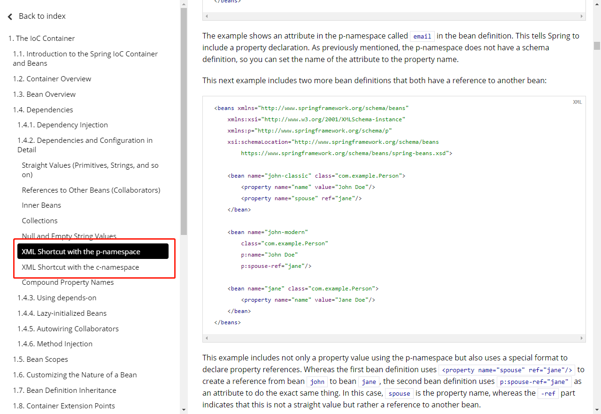


注意点：p命名和c命名空间不能直接使用，需要导入xml约束

```xml
xmlns:p="http://www.springframework.org/schema/p"
xmlns:c="http://www.springframework.org/schema/c"
```

### 5.4、bean的作用域

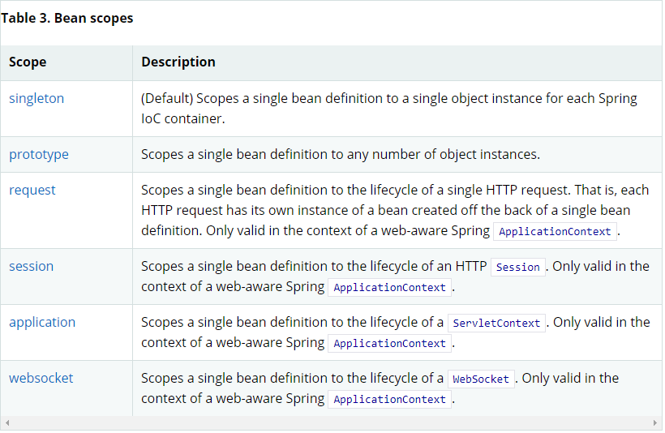

1.单例模式（Spring默认机制）

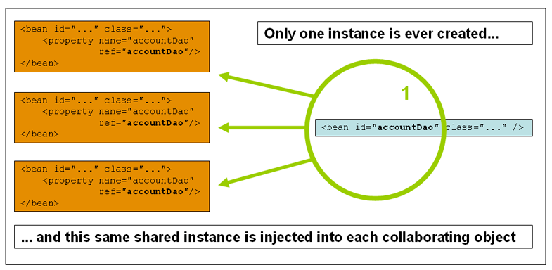

```xml
<bean id="accountService" class="com.something.DefaultAccountService"/>

<!-- the following is equivalent, though redundant (singleton scope is the default) -->
<bean id="accountService" class="com.something.DefaultAccountService" scope="singleton"/>
```


2.原型模式

每次从容器中get的时候，都会产生一个新的对象

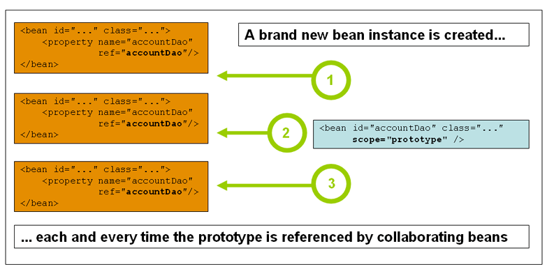

```xml
<bean id="accountService" class="com.something.DefaultAccountService" scope="prototype"/>
```

3.其余的request、session、application这些只能在web开发中使用到！

## 6、Bean的自动装配

- 自动装配是Spring满足bean依赖的一种方式！
- Spring在上下文中自动寻找，并自动给bean装配属性！


在Spring中有三种装配的方式

1. 在xml中显示配置

2. 在java中显示配置

3. 隐式的自动装配bean【重要】

   1. ByName自动装配
   2. ByType自动装配

   ```xml
   byName：会自动在容器上下文中查找，和自己对象set方法后面的值对应的beanid！
   byType：会自动在容器上下文中查找，和自己对象属性类型相同的bean！
   ```


小结：

- byName的时候，需要保证所有bean的id唯一，并且这个bean需要和自动注入的属性的set方法的值一致
- byType的时候，需要保证所有bean的class唯一，并且这个bean需要和自动注入的属性的类型一致

### 使用注解实现自动装配

jdk1.5支持的注解，Spring2.5就支持注解了

The introduction of annotation-based configuration raised the question of whether this approach is “better” than XML.

要使用注解须知：

1. 导入约束。context约束

2. 配置注解的支持：

   ```xml
   <?xml version="1.0" encoding="UTF-8"?>
   <beans xmlns="http://www.springframework.org/schema/beans"
       xmlns:xsi="http://www.w3.org/2001/XMLSchema-instance"
       xmlns:context="http://www.springframework.org/schema/context"
       xsi:schemaLocation="http://www.springframework.org/schema/beans
           https://www.springframework.org/schema/beans/spring-beans.xsd
           http://www.springframework.org/schema/context
           https://www.springframework.org/schema/context/spring-context.xsd">
   
       <context:annotation-config/>
   
   </beans>
   ```

   **@Autowired**

   在属性上适应即可，也可以在set方式上使用！

   使用Autowired我们可以不用编写Set方法，前提是你这个自动配置的属性在IoC（Spring）容器中存在，且符合名字byName！

   科普：

   ```xml
   @Nullable   字段标记了这个注解，书名这个字段可以为null；
   ```


如果`Autowired`自动装配的环境比较复杂，自动装配无法通过一个注解`@Autowired`完成的时候，我们可以使用`@Qualifier(value="XXX")`去配置`@Autowired`的使用，指定唯一的bean对象注入！

```java
public class MovieRecommender {

    @Autowired
    @Qualifier("main")
    private MovieCatalog movieCatalog;

    // ...
}
```

```xml
<?xml version="1.0" encoding="UTF-8"?>
<beans xmlns="http://www.springframework.org/schema/beans"
    xmlns:xsi="http://www.w3.org/2001/XMLSchema-instance"
    xmlns:context="http://www.springframework.org/schema/context"
    xsi:schemaLocation="http://www.springframework.org/schema/beans
        https://www.springframework.org/schema/beans/spring-beans.xsd
        http://www.springframework.org/schema/context
        https://www.springframework.org/schema/context/spring-context.xsd">

    <context:annotation-config/>

    <bean class="example.SimpleMovieCatalog">
        <qualifier value="main"/> 

        <!-- inject any dependencies required by this bean -->
    </bean>

    <bean class="example.SimpleMovieCatalog">
        <qualifier value="action"/> 

        <!-- inject any dependencies required by this bean -->
    </bean>

    <bean id="movieRecommender" class="example.MovieRecommender"/>

</beans>
```


**@Resource注解**

```java
public class MovieRecommender {

    @Resource
    private CustomerPreferenceDao customerPreferenceDao;

    @Resource
    private ApplicationContext context; 

    public MovieRecommender() {
    }

    // ...
}
```


小结：

`@Resource`和`@Autowired`的区别

- 都是用来自动装配的，都可以放在属性字段上
- `@Autowired`默认通过byType方式，如果有多个类型相同，再通过byName方式
- `@Resource`默认通过byName方式，如果找不到名字，再通过byType方式

## 7、使用注解开发

在Spring4之后，要使用注解开发，必须要保证aop的包导入了

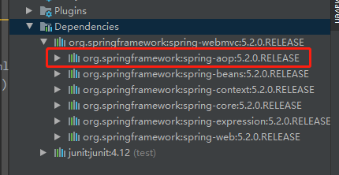

使用注解需要导入context约束，增加注解的支持。

```xml
<?xml version="1.0" encoding="UTF-8"?>
<beans xmlns="http://www.springframework.org/schema/beans"
    xmlns:xsi="http://www.w3.org/2001/XMLSchema-instance"
    xmlns:context="http://www.springframework.org/schema/context"
    xsi:schemaLocation="http://www.springframework.org/schema/beans
        https://www.springframework.org/schema/beans/spring-beans.xsd
        http://www.springframework.org/schema/context
        https://www.springframework.org/schema/context/spring-context.xsd">

    <context:annotation-config/>

</beans>
```

1、bean


2、属性如何注入

**@Component**

```java
// 等价于 <bean id="user" class="com.kuang.pojo.User"/>
// @Componet组件
public class User {
    // 相当于<properties name="name" value="XXX"/>
    @value("XXX")
    public String name;
}
```


3、衍生的注解

@component有几个衍生注解，我们在web开发中，会按照mvc三层架构分层！

- dao【@Repository】
- service【Service】
- controller【Controller】

这四个注解功能都是一样的，都是代表某个类注册到Spring中，装配Bean。


4、自动装配置


5、作用域

@Scope(singleton)


6、小结

xml与注解：

- xml更加万能，使用与任何场合！维护简单方便
- 注解不是自己类则使用不了，维护相对复杂

xml与注解最佳实践：

- xml负责管理bean
- 注解负责完成属性的注入

## 8、使用Java的方式配置Spring

```java
@Configuration
public class AppConfig {

    @Bean
    public MyService myService() {
        return new MyServiceImpl();
    }
}
```

等价于

```xml
<beans>
    <bean id="myService" class="com.acme.services.MyServiceImpl"/>
</beans>
```

使用

```java
public static void main(String[] args) {
    ApplicationContext ctx = new AnnotationConfigApplicationContext(AppConfig.class);
    MyService myService = ctx.getBean(MyService.class);
    myService.doStuff();
}
```

## 9、代理模式

为什么要学代理模式？因为这就是Spring AOP的底层！【Spring AOP 和 Spring MVC】


代理模式的分类：

- 静态代理
- 动态代理

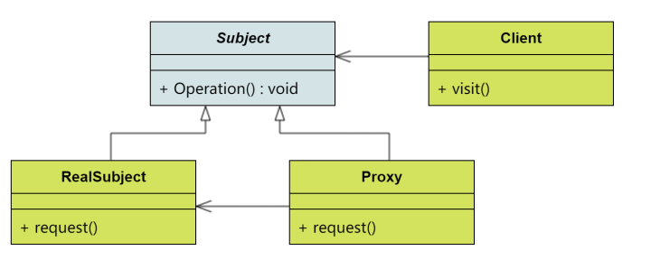

### 9.1、静态代理

角色分析：

- 抽象角色：一般会使用接口或者抽象类来解决
- 真实角色：被代理的角色
- 代理角色：代理真实角色，代理真实角色后，我们一般会做一些附属操作
- 客户：访问代理对象的人


代码步骤：

1. 接口
2. 真实角色
3. 代理角色
4. 客户端访问代理角色


代理模式的好处：

- 可以使真实角色的操作更加纯粹！不用去关注一些公共的事务
- 公共也就交给代理角色！实现了业务的分工
- 公共业务发生扩展的时候，方便集中管理

缺点：

- 一个真实角色就会产生一个代理角色，代码量会翻倍，开发效率会降低


### 9.2、加深理解

聊聊AOP

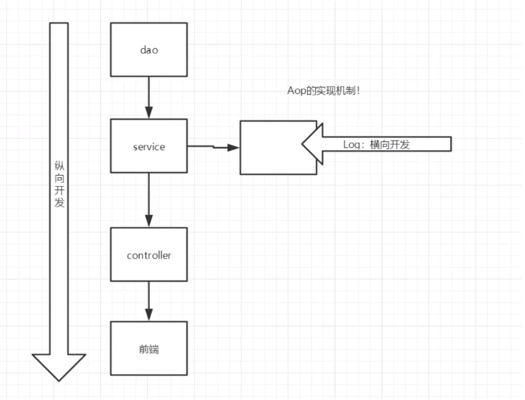

### 9.3、动态代理

- 动态代理和静态代理角色一样
- 动态代理的代理类是动态生成的，不是我们直接写好的！
- 动态代理分为两大类：基于接口的动态代理，基于类的动态代理
  - 基于接口的动态代理——JDK动态代理
  - 基于类：cglib
  - java字节码实现：javasist


需要了解两个类：proxy 代理，InvocationHandler 调用处理程序


动态代理的好处：

- 一个动态代理类代理的是一个接口，一般就是对应的一类业务
- 一个动态代理类可以代理多个类，只要是实现了同一个接口即可

## 10、AOP

### 10.1、什么是AOP

AOP（Aspect Oriented Programming）意为：面向切面编程，通过预编译方式和运行期动态代理实现程序功能的统一维护的一种技术。AOP是OOP的延续，是软件开发的一个热点，也是Spring框架中的一个重要内容，是函数式编程的一种衍生泛型。利用AOP可以对业务逻辑的各个部分进行隔离，从而使得业务逻辑各部分之间的耦合度降低，提高程序的可重用性，同时提高了开发的效率。

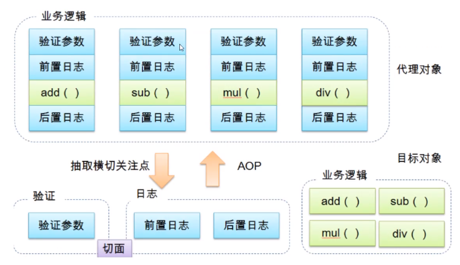

简单地去理解，其实AOP要做三类事：

- 在哪里切入，也就是权限校验等非业务操作在哪些业务代码中执行。
- 在什么时候切入，是业务代码执行前还是执行后。
- 切入后做什么事，比如做权限校验、日志记录等。


### 10.2、AOP在Spring中的作用

提供声明式事务：允许用户自定义切面

- 横切关注点：跨越应用程序多个模块的方法或功能。即是，与我们业务逻辑无关的，但是我们需要关注的部分，就是横切关注点。如日志，安全，缓存，事务等等。。。
- 切面（Aspect）：横切关注点被模块化的特殊对象。即，它是一个类。
- 通知（Advice）：切面必须要完成的工作。即，它是类中的一个方法。
- 目标（Target）：被通知对象。
- 代理（Proxy）：被目标对象应用通知之后创建的对象。
- 切入点（PointCut）：切面通知执行的“地点”的定义。
- 连接点（JointPoint）：与切入点匹配的执行点。

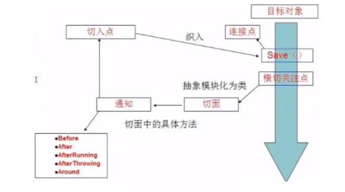

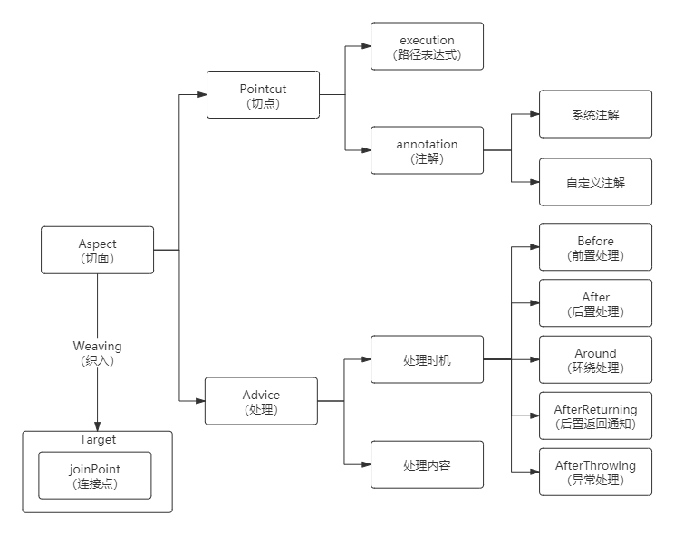

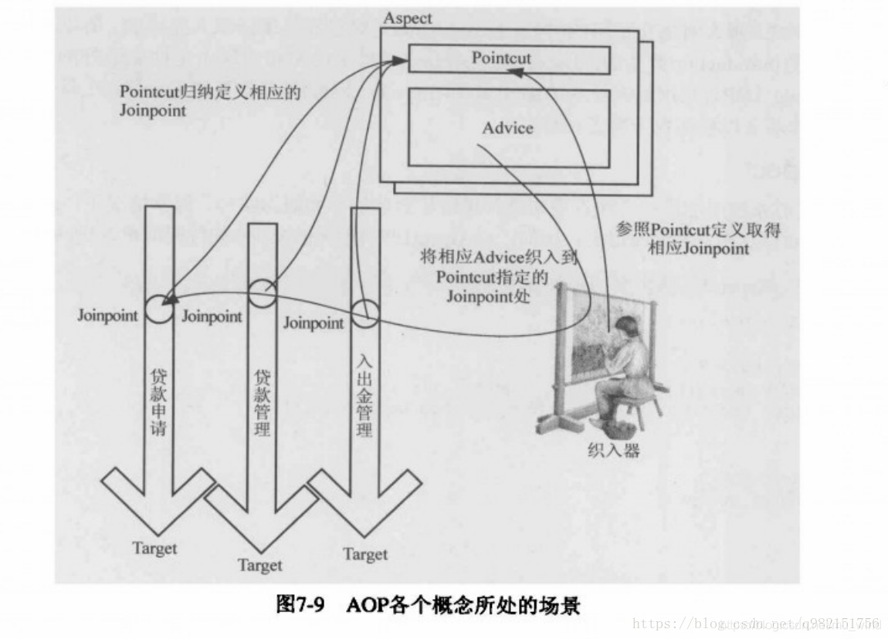

**可参考的优秀博客：**https://blog.csdn.net/mu_wind/article/details/102758005


Spring AOP中，通过Advice定义横切逻辑，Spring中支持五种类型的Advice

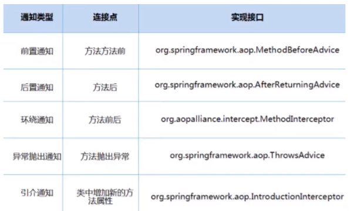

即AOP在不改变原有代码的情况下，去增加新的功能。

### 10.3、使用Spring实现AOP

【重点】使用AOP织入，需要导入一个依赖包！

```xml
<!-- https://mvnrepository.com/artifact/org.aspectj/aspectjweaver -->
<dependency>
    <groupId>org.aspectj</groupId>
    <artifactId>aspectjweaver</artifactId>
    <version>1.9.4</version>
    <scope>runtime</scope>
</dependency>

```


#### **方式一：使用Spring的API接口**

【主要是SpringAPI接口实现】

```xml
<?xml version="1.0" encoding="UTF-8"?>
<beans xmlns="http://www.springframework.org/schema/beans"
       xmlns:xsi="http://www.w3.org/2001/XMLSchema-instance" xmlns:aop="http://www.springframework.org/schema/aop"
       xsi:schemaLocation="http://www.springframework.org/schema/beans http://www.springframework.org/schema/beans/spring-beans.xsd http://www.springframework.org/schema/aop https://www.springframework.org/schema/aop/spring-aop.xsd">
    <!--注册bean-->
    <bean id="userService" class="com.kuang.service.UserServiceImpl"/>
    <bean id="log" class="com.kuang.log.Log"/>
    <bean id="afterLog" class="com.kuang.log.AfterLog"/>

<!--    配置AOP：需要导入AOP的约束-->
<!--    方式一：使用原生的Spring API接口-->
    <aop:config>
<!--        切入点：expression：表达式，execution（要执行的位置！****）-->
        <aop:pointcut id="pointcut" expression="execution(* com.kuang.service.UserServiceImpl.*(..))"/>
        <aop:advisor advice-ref="log" pointcut-ref="pointcut"/>
        <aop:advisor advice-ref="afterLog" pointcut-ref="pointcut"/>

    </aop:config>
</beans>
```

```java
import com.kuang.service.UserService;
import org.junit.Test;
import org.springframework.context.ApplicationContext;
import org.springframework.context.support.ClassPathXmlApplicationContext;

/**
 * Description:
 *
 * @author wenjie
 * @date Create on 2020/11/17
 */
public class MyTest {
    @Test
    public void test() {
        ApplicationContext context = new ClassPathXmlApplicationContext("ApplicationContext.xml");
        // 动态代理代理的是接口
        UserService userService = context.getBean("userService", UserService.class);

        userService.add();
    }
}

```

#### 方式二：自定义类

【主要是切面定义】

```xml
    <aop:config>
<!--        自定义切面，ref 要引用的类-->
        <aop:aspect ref="diy">
<!--            切入点-->
            <aop:pointcut id="point" expression="execution(* com.kuang.service.UserServiceImpl.*(..))"/>
<!--            通知-->
            <aop:before method="before" pointcut-ref="point"/>
            <aop:after method="after" pointcut-ref="point"/>
        </aop:aspect>
    </aop:config>
```

#### 方式三：使用注解

```java
package com.kuang.diy;

import org.aspectj.lang.ProceedingJoinPoint;
import org.aspectj.lang.Signature;
import org.aspectj.lang.annotation.After;
import org.aspectj.lang.annotation.Around;
import org.aspectj.lang.annotation.Aspect;
import org.aspectj.lang.annotation.Before;

/**
 * Description:
 *
 * @author wenjie
 * @date Create on 2020/11/17
 */
// 方式三：使用注解方式实现AOP
@Aspect // 标注这个类是一个切面
public class AnnotationPointCut {

    @Before("execution(* com.kuang.service.UserServiceImpl.*(..))")
    public void before() {
        System.out.println("方式执行前！");
    }

    @After("execution(* com.kuang.service.UserServiceImpl.*(..))")
    public void after() {
        System.out.println("方法执行后！");
    }

    // 在环绕增强中，我们可以给定一个参数，代表我们要获取处理切入的点
    @Around("execution(* com.kuang.service.UserServiceImpl.*(..))")
    public void around(ProceedingJoinPoint jp) throws Throwable {
        System.out.println("环绕前！");

        Signature signature = jp.getSignature(); // 获得签名
        System.out.println("signature:"+signature);

        // 执行方法
        Object proceed = jp.proceed();

        System.out.println("环绕后！");
    }
}

/**
 * 环绕前！
 * signature:void com.kuang.service.UserService.delete()
 * 方式执行前！
 * 删除了一个用户
 * 环绕后！
 * 方法执行后！
 */
```

```xml
<!--    方式三-->
    <bean id="annatationPointCut" class="com.kuang.diy.AnnotationPointCut"/>
<!--    开启注解执行-->
    <aop:aspectj-autoproxy/>
```

## 11、整合Mybatis

1. 编写实体类
2. 编写核心配置文件
3. 编写接口
4. 编写Mapper.xml
5. 测试


参考spring整合mybatis的中文官网：http://mybatis.org/spring/zh/

## 12、声明式事务

### 1、回顾事务

- 把一组业务当成一个业务来做，要么都成功，要么都失败！
- 事务在项目开发中，十分的重要，设计到数据的一致性和完整性的问题，不能马虎！


事务ACID原则

- 原子性（Atomicity）
- 一致性（Consistency）
- 隔离性（Isolation）
- 持久性（Durability）


### 2、Spring中的事务管理

- 声明式事务：AOP
- 编程式事务：需要在代码中，进行事务的管理


思考：

为什么需要事务？

- 如果不配置事务，可能存在数据提交不一致的情况；
- 如果我们不在Spring中去配置声明式事务，我们就需要在代码中手动配置事务！
- 事务在我们项目的开发中十分重要，涉及到数据的一致性和完整性问题，不容马虎！