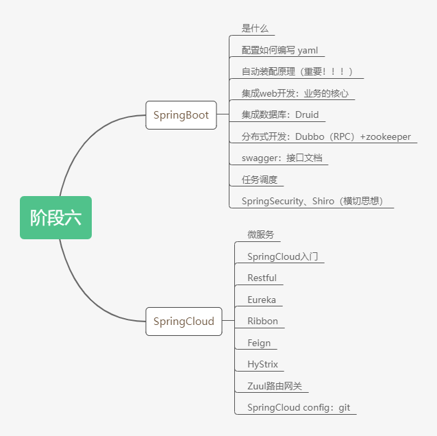
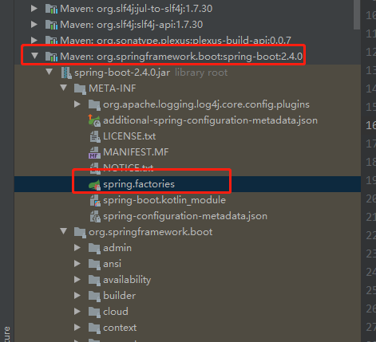

## 1、微服务阶段

javase：OOP

mysql：持久化

html+css+js+jquery+框架

javaweb：独立开发MVC三层架构的网站

ssm：框架，简化了我们的开发流程，配置也开始较为复杂；

**war：tomcat运行**

spring再简化：SpringBoot，微服务架构！

服务越来越多：SpringCloud；（管理SpringBoot）



**什么是微服务？**

微服务是一种架构风格，它要求我们在开发一个应用的时候，这个应用必须构建成一系列小服务的组合；可以通过http的方式进行互通。要说微服务架构，先得说说过去我们的单体应用架构。


**单体应用架构：**

所谓单体应用架构（all in one）是指，我们将一个应用中的所有应用服务都封装在一个应用中。

无论是ERP、CRM或是其他什么系统，你都把数据库访问，web访问，等等各个功能放到一个war包内。

- 这样做的好处是，易于开发和测试；也十分方便部署；当需要扩展时，只需要将war复制多份，然后放到多个服务器上，再做个负载均衡就可以了。
- 单体应用架构的缺点是，哪怕我要修改一个非常小的地方，我们都需要停掉整个服务，重新打包、部署这个应用war包。特别是对于一个大型应用，我们不可能把所有内容都放在一个应用里面，我们如何维护、如何分工合作都是问题。


**微服务架构：**

all in one的架构方式，我们把所有的功能单元放在一个应用里面。然后我们把整个应用部署到服务器上。如果负载能力不行，我们将整个应用进行水平复制，然后进行扩展，然后再负载均衡。

所谓微服务架构，就是打破all in one的架构方式，把每个功能元素独立出来。把独立出来的功能元素的动态组合，需要的功能元素才去拿来组合，需要多一些时，可以整合多个功能元素。所以微服务架构是对功能元素进行复制，而没有对整个应用进行复制。

这样做的好处是：

1. 节省了调用资源。
2. 每个功能元素的服务都是一个可替换的


**如何构建微服务：**

一个大型系统的微服务架构，就像一个复杂交织的神经网络，每一个神经元就是一个功能元素，它们各自完成自己的功能，然后通过http相互请求调用。比如一个电商系统，查缓存、连数据库、浏览网页、结账、支付等服务都是一个个独立的功能服务，都被微化了，它们作为一个个微服务共同构建了一个庞大的系统。如果修改其中的一个功能，只需要更新升级其中一个功能服务单元即可。

但是这种庞大的系统架构给部署和运维带来了很大的难度。于是，Spring为我们带来了构建大型分布式微服务的全套、全程产品：

- 构建一个个功能独立的微服务应用单元，可以使用SpringBoot，可以帮我们快速构建一个应用；
- 大型分布式网络服务的调用，这部分由Spring Cloud来完成，实现分布式；
- 在分布式中间，进行流式数据计算、批处理，我们有Spring Cloud data flow；
- Spring为我们想清楚了整个从开始构建应用到大型分布式应用全流程方案。

## 2、原理初探

### 自动装配

**pom.xml**

- spring-boot-dependencies：核心依赖在父工程中！
- 我们在写或者引入一些SpringBoot依赖的时候，不需要指定版本，就是因为有这些版本仓库


**启动器**

```xml
<dependency>
    <groupId>org.springframework.boot</groupId>
    <artifactId>spring-boot-starter-web</artifactId>
</dependency>
```

- 说白了就是SpringBoot的启动场景；
- 比如spring-boot-starter-web，它就会帮我们自动导入web环境所有的依赖！
- SpringBoot会将所有的功能场景，都变成一个个的启动器
- 我们要使用什么功能，就只需要找到对应的启动器就可以了 `starter`


**主程序**

```java
// 标注这个类是一个SpringBoot的应用
@SpringBootApplication
public class DemoApplication {

    // 将SpringBoot应用启动
    public static void main(String[] args) {
        SpringApplication.run(DemoApplication.class, args);
    }

}
```

- 注解

  - ```xml
    @SpringBootConfiguration：SpringBoot的配置
    	@Configuration：Spring配置类
    		@Component：说明这也是一个Spring组件
    	
    @EnableAutoConfiguration：自动配置
    	@AutoConfigurationPackage：自动配置包
    
    ```


META-INF/spring.factories：自动配置的核心文件




**结论：**

SpringBoot所有自动装配都是在启动的时候扫描并加载：`spring.factories`所有的自动配置类都在这里面，但是不一定生效，要判断条件是否成立，主要导入了对应的starter，就有对应的启动器了，我们自动装配就会生效，然后就配置成功！

1. SpringBoot在启动的时候，从类路径下/META/spring.factories获取指定的值；
2. 将这些自动配置的类导入容器，自动配置就会生效，帮我们进行自动配置
3. 以前我们需要自动配置的东西，现在SpringBoot帮我们做了
4. 整合JavaEE，解决方案和自动配置的东西都在spring-boot-autoconfigure-2.2.0.RELEASE.jar这个包下
5. 它会把所有需要导入的组件，以类名的方式返回，这些组件就会被添加到容器；
6. 容器中也会存在非常多的XXXAutoConfiguration的文件，就是这些类给容器中导入了这个场景需要的所有组件，并自动配置
7. 有了自动配置类，免去了我们手动编写配置的文件


## 3、SpringBoot Web开发

jar：webapp！

自动装配

SpringBoot到底帮我们配置了什么？我们能不能进行修改？能修改哪些东西？能不能扩展？

- xxxAutoConfiguration：向容器中自动配置组件
- xxxProperties：自动配置类，装配配置文件中自定义的一些内容！


要解决的问题：

- 导入静态资源
- 首页
- 模板引擎Thymeleaf
- 装配扩展SpringMVC
- 增删改查
- 拦截器
- 国际化


### 3.1、静态资源

1. 在SpringBoot，我们可以使用以下方式处理静态资源
   - webjars	localhost:8080/webjars/
   - public，static，/**，resources       localhost:8080/
2. 优先级：resources>static（默认）>public


### 3.2、首页如何定制

**模板引擎**

只要需要使用thymeleaf，只需要导入对应的依赖就可以了！我们将html放在我们的templates目录下即可！