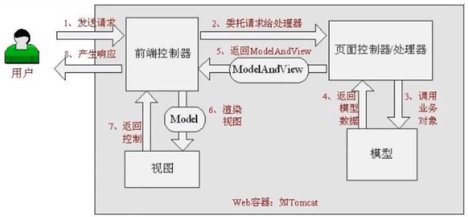
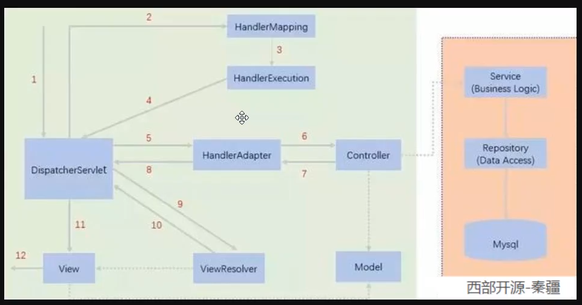
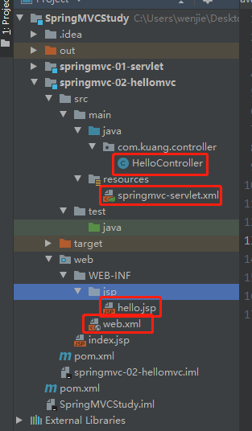

## 1、SpringMVC

为什么要学习SpringMVC？

SpringMVC的特点：

1. 轻量级，简单易学
2. 高效，基于请求响应的MVC框架
3. 与Spring兼容性好，无缝结合
4. 约定优于配置
5. 功能强大：RESTful、数据验证、格式化、本地化、主题等
6. 简洁灵活

Spring的web框架围绕DispatcherServlet【调度Servlet】设计。






**简要分析执行流程：**

1. DispatcherServlet表示前置控制器，是整个SpringMVC的控制中心。用户发出请求，DispatcherServlet接受请求并拦截请求。
   - 我们假设请求的url为：http://localhost:8080/SpringMVC/hello
   - 如上url拆分成三部分：
   - http://localhost:8080 服务器域名
   - SpringMVC 部署在服务器上的web站点
   - hello表示控制器
   - 通过分析，如上url表示为：请求位于服务器localhost:8080上的SpringMVC站点的hello控制器。
2. HandlerMapping为处理器映射。DispatcherServlet调用HandlerMapping，HandlerMapping根据请求url查找Handler。
3. HandlerExecution表示具体的Handler，其主要作用是根据url查找控制器，如上url被查找控制器为：hello。
4. HandlerExecution将解析后的信息传递给DispatcherServlet，如解析控制器映射等。
5. HandlerAdapter表示处理器适配器，其按照特定的规则去执行Handler。
6. Handler让具体的Controller执行。
7. Controller将具体的执行信息返回给HandlerAdapter，如ModelAndView。
8. HandlerAdapter将试图逻辑名或模型传递给DispatcherServlet。
9. DispatcherServlet调用视图解析器（ViewResolve）来解析HandlerAdapter传递的逻辑视图名。
10. 视图解析器将解析的逻辑视图传给DispatcherServlet。
11. DispatcherServlet根据视图解析器解析的视图结果，调用具体的视图。
12. 最终视图呈现给用户。


**HelloController**

```java
package com.kuang.controller;

import org.springframework.web.servlet.ModelAndView;
import org.springframework.web.servlet.mvc.Controller;

import javax.servlet.http.HttpServletRequest;
import javax.servlet.http.HttpServletResponse;
import java.text.DecimalFormat;

/**
 * Description:
 *
 * @author wenjie
 * @date Create on 2020/11/23
 */
// 注意：这里我们先导入Controller接口
public class HelloController implements Controller {

    @Override
    public ModelAndView handleRequest(HttpServletRequest httpServletRequest, HttpServletResponse httpServletResponse) throws Exception {
        // ModelAndView 模型和视图
        ModelAndView modelAndView = new ModelAndView();

        // 封装对象，放在ModelAndView中.Model
        modelAndView.addObject("msg","HelloSpringMVC!");

        // 封装要跳转的视图，放在ModelAndView中
        modelAndView.setViewName("hello");  // : /WEB-INF/jsp/hello.jsp

        return modelAndView;
    }
}

```


**springmvc-servlet.xml**

```xml
<?xml version="1.0" encoding="UTF-8"?>
<beans xmlns="http://www.springframework.org/schema/beans"
       xmlns:xsi="http://www.w3.org/2001/XMLSchema-instance"
       xsi:schemaLocation="http://www.springframework.org/schema/beans http://www.springframework.org/schema/beans/spring-beans.xsd">
    <!--处理器映射器-->
    <bean class="org.springframework.web.servlet.handler.BeanNameUrlHandlerMapping"/>
    <!--处理器适配器-->
    <bean class="org.springframework.web.servlet.mvc.SimpleControllerHandlerAdapter"/>

    <!--视图解析器：DispatcherServlet给他的ModelAndView-->
    <bean class="org.springframework.web.servlet.view.InternalResourceViewResolver" id="internalResourceViewResolver">
        <!--前缀-->
        <property name="prefix" value="/WEB-INF/jsp/"/>
        <!--后缀-->
        <property name="suffix" value=".jsp"/>
    </bean>

    <!--Handler-->
    <bean id="/hello" class="com.kuang.controller.HelloController"/>
</beans>
```


**web.xml**

```xml
<?xml version="1.0" encoding="UTF-8"?>
<web-app xmlns="http://xmlns.jcp.org/xml/ns/javaee"
         xmlns:xsi="http://www.w3.org/2001/XMLSchema-instance"
         xsi:schemaLocation="http://xmlns.jcp.org/xml/ns/javaee http://xmlns.jcp.org/xml/ns/javaee/web-app_4_0.xsd"
         version="4.0">
    <!--注册DispatcherServlet：请求分发器，前端控制器-->
    <servlet>
        <servlet-name>springmvc</servlet-name>
        <servlet-class>org.springframework.web.servlet.DispatcherServlet</servlet-class>
        <!--关联一个springmvc的配置文件：【servlet-name】-servlet.xml-->
        <init-param>
            <param-name>contextConfigLocation</param-name>
            <param-value>classpath:springmvc-servlet.xml</param-value>
        </init-param>
        <!--启动级别-->
        <load-on-startup>1</load-on-startup>
    </servlet>

    <!--/ 匹配所有的请求：（不包括.jsp）-->
    <!--/* 匹配所有的请求：（包括.jsp）-->
    <servlet-mapping>
        <servlet-name>springmvc</servlet-name>
        <url-pattern>/</url-pattern>
    </servlet-mapping>
</web-app>
```


**index.jsp**

```jsp
<%@ page contentType="text/html;charset=UTF-8" language="java" %>
<html>
  <head>
    <title>$Title$</title>
  </head>
  <body>
  $END$
  </body>
</html>

```

