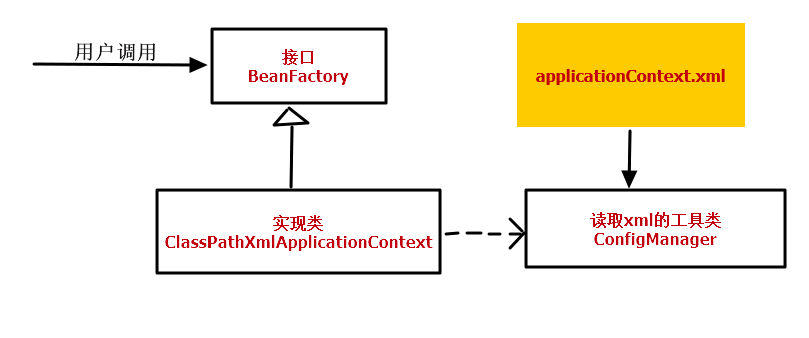
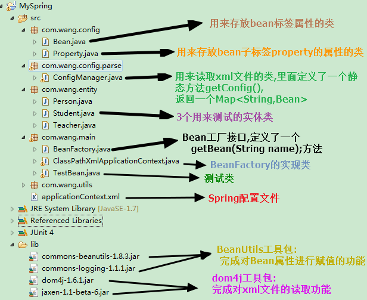

**转载来源：【https://www.cnblogs.com/fingerboy/p/5425813.html】**	

## 主要思想

提到IOC,第一反应就是控制反转,我以前以为SpringIOC就是控制反转,控制反转就是SpringIOC,当然这种理解是错误的,控制反转是一种思想,一种模式,而Spring的IOC容器是实现了这种思想这种模式的一个载体.

使用过Spring的人都熟知,SpringIOC容器可以在对象生成或初始化时就直接将数据注入到对象中,如果对象A的属性是另一个对象B,还可以将这个对象B的引用注入到注入到A的数据域中.

如果在初始化对象A的时候,对象B还没有进行初始化,而A又需要对象B作为自己的属性,那么就会用一种递归的方式进行注入,这样就可以把对象的依赖关系清晰有序的建立起来.

IOC容器解决问题的核心就是把创建和管理对象的控制权从具体的业务对象手中抢过来.由IOC容器来管理对象之间的依赖关系,并由IOC容器完成对象的注入.这样就把应用从复杂的对象依赖关系的管理中解放出来,简化了程序的开发过程.



- 程序中所有的Bean之间的依赖关系我们是放在一个xml文件中进行维护的,就是**applicationContext.xml**
- **ConfigManager**类完成的功能是读取xml,并将所有读取到有用的信息封装到我们创建的一个Map<String,Bean>集合中,用来在初始化容器时创建bean对象.
- 定义一个**BeanFactory**的接口,接口中有一个getBean(String name)方法,用来返回你想要创建的那个对象.
- 然后定义一个该接口的实现类**ClassPathXmlApplicationContext**.就是在这个类的构造方法中,初始化容器,通过调用ConfigManager的方法返回的Map集合,通过反射和内省一一创建bean对象.这里需要注意,对象的创建有两个时间点,这取决与bean标签中scope属性的值:
  - 如果scope="singleton",那么对象在容器初始化时就已创建好,用的时候只需要去容器中取即可.
  - 如果scope="prototype",那么容器中不保存这个bean的实例对象,每次开发者需要使用这个对象时再进行创建.

## 使用的主要知识点

- dom4j解析xml文件

- xpath表达式(用于解析xml中的标签)

- java反射机制

- 内省(获取Bean属性的set方法进行赋值)

## 项目结构图



项目需要的jar包与项目结构已经在上图中介绍了,**这个项目所能实现的功能**如下:

1. IOC容器能管理对象的创建以及对象之间的依赖关系.
2. 能够实现数据的自动类型转换(借助BeanUtils).
3. 能够实现scope="singleton"和scope="prototype"的功能,即能够控制对象是否为单例.

## 代码介绍

**application.xml:**

```xml
<?xml version="1.0" encoding="utf-8"?>
<beans>
    <bean name="student" class="com.wang.entity.Student" >
        <property name="name" value="123"></property>
    </bean>
    
    <bean name="teacher" class="com.wang.entity.Teacher">
        <property name="student" ref="student"></property>
    </bean>
    <bean name="person" class="com.wang.entity.Person" scope="prototype">
        <property name="teacher" ref="teacher"></property>
        <property name="student" ref="student"></property>
    </bean>
    
</beans>
```


**实体类Student,Teacher,Person:**

```java
package com.wang.entity;
//Student类
public class Student {
    private String name;

    public String getName() {
        return name;
    }

    public void setName(String name) {
        this.name = name;
    }
}
/************************************/
package com.wang.entity;
//Teacher类
public class Teacher {

    private Student student;

    public Student getStudent() {
        return student;
    }

    public void setStudent(Student student) {
        this.student = student;
    }
     
}
/************************************/
package com.wang.entity;
//Person类
public class Person {

    private Student student;
    private Teacher teacher;
    
    public Student getStudent() {
        return student;
    }
    public void setStudent(Student student) {
        this.student = student;
    }
    public Teacher getTeacher() {
        return teacher;
    }
    public void setTeacher(Teacher teacher) {
        this.teacher = teacher;
    }
}
```


**用于封装Bean标签信息的Bean类:**

```java
package com.wang.config;

import java.util.ArrayList;
import java.util.List;

public class Bean {

    
    private String name;
    private String className;
    private String scope="singleton";
    private List<Property> properties=new ArrayList<Property>();

    
    public String getScope() {
        return scope;
    }

    public void setScope(String scope) {
        this.scope = scope;
    }

    public String getName() {
        return name;
    }

    public void setName(String name) {
        this.name = name;
    }

    public String getClassName() {
        return className;
    }

    public void setClassName(String className) {
        this.className = className;
    }

    public List<Property> getProperties() {
        return properties;
    }

    public void setProperties(List<Property> properties) {
        this.properties = properties;
    }

    
}
```


**用与封装Bean子标签property内容的Property类:**

```java
package com.wang.config;

public class Property {

    private String name;
    private String value;
    private String ref;
    public String getName() {
        return name;
    }
    public void setName(String name) {
        this.name = name;
    }
    public String getValue() {
        return value;
    }
    public void setValue(String value) {
        this.value = value;
    }
    public String getRef() {
        return ref;
    }
    public void setRef(String ref) {
        this.ref = ref;
    }

    
}
```


**ConfigManager类:**

```java
package com.wang.config.parse;

import java.io.InputStream;
import java.util.HashMap;
import java.util.List;
import java.util.Map;

import org.dom4j.Document;
import org.dom4j.DocumentException;
import org.dom4j.Element;
import org.dom4j.io.SAXReader;
import org.junit.Test;

import com.wang.config.Bean;
import com.wang.config.Property;

public class ConfigManager {
    
    private static Map<String,Bean> map=new HashMap<String,Bean>(); 

    //读取配置文件并返回读取结果
    //返回Map集合便于注入,key是每个Bean的name属性,value是对应的那个Bean对象
    public static Map<String, Bean> getConfig(String path){
        /*dom4j实现
         *  1.创建解析器
         *  2.加载配置文件,得到document对象
         *  3.定义xpath表达式,取出所有Bean元素
         *  4.对Bean元素继续遍历
         *      4.1将Bean元素的name/class属性封装到bean类属性中
         *      4.2获得bean下的所有property子元素
         *      4.3将属性name/value/ref分装到类Property类中
         *  5.将property对象封装到bean对象中
         *  6.将bean对象封装到Map集合中,返回map 
            */
        //1.创建解析器
        SAXReader reader=new SAXReader();
        //2.加载配置文件,得到document对象
        InputStream is = ConfigManager.class.getResourceAsStream(path);
        Document doc =null;
        try {
             doc = reader.read(is);
        } catch (DocumentException e) {
            e.printStackTrace();
            throw new RuntimeException("请检查您的xml配置是否正确");
        }
        // 3.定义xpath表达式,取出所有Bean元素
        String xpath="//bean";
        
        //4.对Bean元素继续遍历
        List<Element> list = doc.selectNodes(xpath);
        if(list!=null){
            //4.1将Bean元素的name/class属性封装到bean类属性中
        
             // 4.3将属性name/value/ref分装到类Property类中
            for (Element bean : list) {
                Bean b=new Bean();
                String name=bean.attributeValue("name");
                String clazz=bean.attributeValue("class");
                String scope=bean.attributeValue("scope");
                b.setName(name);
                b.setClassName(clazz);
                if(scope!=null){
                    b.setScope(scope);
                }
                 //  4.2获得bean下的所有property子元素
                List<Element> children = bean.elements("property");
                
                 // 4.3将属性name/value/ref分装到类Property类中
                if(children!=null){
                    for (Element child : children) {
                        Property prop=new Property();
                        String pName=child.attributeValue("name"); 
                        String pValue=child.attributeValue("value");
                        String pRef=child.attributeValue("ref");
                        prop.setName(pName);
                        prop.setRef(pRef);
                        prop.setValue(pValue);
                        // 5.将property对象封装到bean对象中
                        b.getProperties().add(prop);
                    }
                }
                //6.将bean对象封装到Map集合中,返回map 
                map.put(name, b);
            }
        }
        
        return map;
    }

}
```


**BeanFactory接口:**

```java
package com.wang.main;

public interface BeanFactory {
    //核心方法getBean
    Object getBean(String name);
}
```


**ClassPathXmlApplicationContext类:**

```java
package com.wang.main;

import java.lang.reflect.InvocationTargetException;
import java.lang.reflect.Method;
import java.util.HashMap;
import java.util.Map;
import java.util.Map.Entry;

import org.apache.commons.beanutils.BeanUtils;
import org.junit.Test;

import com.wang.config.Bean;
import com.wang.config.Property;
import com.wang.config.parse.ConfigManager;
import com.wang.entity.Student;
//import com.wang.utils.BeanUtils;
import com.wang.utils.BeanUtil;

public class ClassPathXmlApplicationContext implements BeanFactory {

    // 获得读取的配置文件中的Map信息
    private Map<String, Bean> map;
    // 作为IOC容器使用,放置sring放置的对象
    private Map<String, Object> context = new HashMap<String, Object>();

    public ClassPathXmlApplicationContext(String path) {
        // 1.读取配置文件得到需要初始化的Bean信息
        map = ConfigManager.getConfig(path);
        // 2.遍历配置,初始化Bean
        for (Entry<String, Bean> en : map.entrySet()) {
            String beanName = en.getKey();
            Bean bean = en.getValue();

            Object existBean = context.get(beanName);
            // 当容器中为空并且bean的scope属性为singleton时
            if (existBean == null && bean.getScope().equals("singleton")) {
                // 根据字符串创建Bean对象
                Object beanObj = createBean(bean);

                // 把创建好的bean对象放置到map中去
                context.put(beanName, beanObj);
            }
        }

    }

    // 通过反射创建对象
    private Object createBean(Bean bean) {
        // 创建该类对象
        Class clazz = null;
        try {
            clazz = Class.forName(bean.getClassName());
        } catch (ClassNotFoundException e) {
            e.printStackTrace();
            throw new RuntimeException("没有找到该类" + bean.getClassName());
        }
        Object beanObj = null;
        try {
            beanObj = clazz.newInstance();
        } catch (Exception e) {
            e.printStackTrace();
            throw new RuntimeException("没有提供无参构造器");
        }
        // 获得bean的属性,将其注入
        if (bean.getProperties() != null) {
            for (Property prop : bean.getProperties()) {
                // 注入分两种情况
                // 获得要注入的属性名称
                String name = prop.getName();
                String value = prop.getValue();
                String ref = prop.getRef();
                // 使用BeanUtils工具类完成属性注入,可以自动完成类型转换
                // 如果value不为null,说明有
                if (value != null) {
                    Map<String, String[]> parmMap = new HashMap<String, String[]>();
                    parmMap.put(name, new String[] { value });
                    try {
                        BeanUtils.populate(beanObj, parmMap);
                    } catch (Exception e) {
                        e.printStackTrace();
                        throw new RuntimeException("请检查你的" + name + "属性");
                    }
                }

                if (ref != null) {
                    // 根据属性名获得一个注入属性对应的set方法
                    // Method setMethod = BeanUtil.getWriteMethod(beanObj,
                    // name);

                    // 看一看当前IOC容器中是否已存在该bean,有的话直接设置没有的话使用递归,创建该bean对象
                    Object existBean = context.get(prop.getRef());
                    if (existBean == null) {
                        // 递归的创建一个bean
                        existBean = createBean(map.get(prop.getRef()));
                        // 放置到context容器中
                        // 只有当scope="singleton"时才往容器中放
                        if (map.get(prop.getRef()).getScope()
                                .equals("singleton")) {
                            context.put(prop.getRef(), existBean);
                        }
                    }
                    try {
                        // setMethod.invoke(beanObj, existBean);　　　　　　　　　　　　　　//通过BeanUtils为beanObj设置属性
                        BeanUtils.setProperty(beanObj, name, existBean);
                    } catch (Exception e) {
                        e.printStackTrace();
                        throw new RuntimeException("您的bean的属性" + name
                                + "没有对应的set方法");
                    }

                }

            }
        }

        return beanObj;
    }

    @Override
    public Object getBean(String name) {
        Object bean = context.get(name);
        // 如果为空说明scope不是singleton,那么容器中是没有的,这里现场创建
        if (bean == null) {
            bean = createBean(map.get(name));
        }

        return bean;
    }

}
```


**测试类TestBean:**

```java
package com.wang.main;

import org.junit.Test;

import com.wang.entity.Person;
import com.wang.entity.Student;
import com.wang.entity.Teacher;


public class TestBean {

    @Test
    public void func1(){
        
        BeanFactory bf=new ClassPathXmlApplicationContext("/applicationContext.xml");
        Person s=(Person)bf.getBean("person");
        Person s1=(Person)bf.getBean("person");
        System.out.println(s==s1);
        System.out.println(s1);
        Student stu1=(Student) bf.getBean("student");
        Student stu2=(Student) bf.getBean("student");
        String name=stu1.getName();
        System.out.println(name);
        System.out.println(stu1==stu2);
    }
}
```


**测试结果：**

```
false
com.entiy.Person@79b4d0f
逝清雪
true
```


